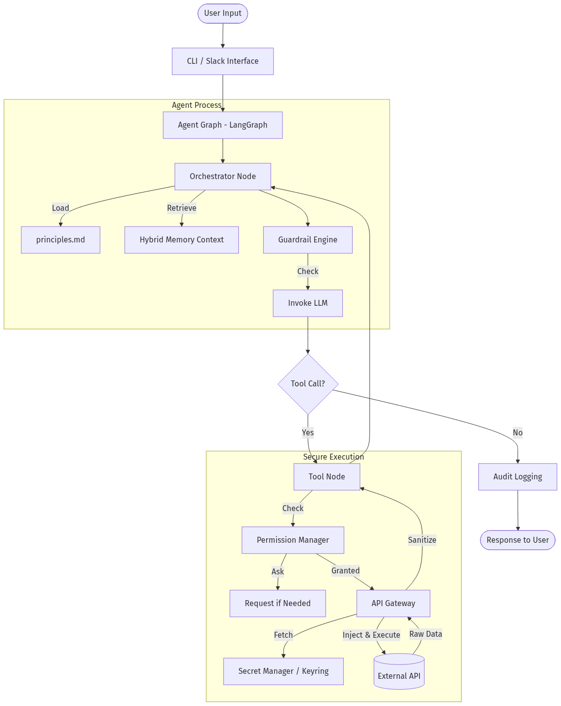
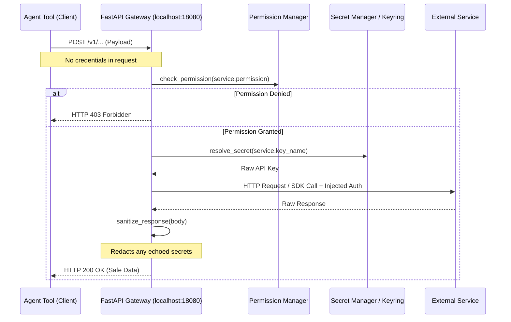

# Atlas Technical Documentation

This document contains technical details about Atlas implementation, architecture, and development.

---

## Table of Contents

- [System Architecture](#system-architecture)
- [System Prompt Integration](#system-prompt-integration)
- [Implementation Details](#implementation-details)
- [Security Architecture](#security-architecture)
- [Development Guide](#development-guide)
- [Testing](#testing)

---

## System Architecture

### Overview

Atlas is built on a modular architecture with the following key components:



### Core Components

#### 1. **LLM Layer**
- **Ollama Integration**: Local LLM inference via Ollama
- **Model Support**: Compatible with any Ollama model (qwen3:14b, llama3.2, mistral, etc.)
- **Tool Binding**: LangChain tool integration for function calling

#### 2. **Agent Graph (LangGraph)**
- **Orchestrator Node**: Main reasoning and decision-making
- **Memory Node**: Retrieves relevant conversation context
- **Permission Node**: Handles permission requests
- **Tool Node**: Executes tools with security checks
- **State Management**: Maintains conversation state and context

#### 3. **Security Layer**
- **Permission Manager**: Least-privilege access control
- **Audit Logger**: Cryptographically verified event logging
- **Secret Manager**: Secure API key storage using macOS Keychain
- **API Gateway**: Secure outbound request routing, secret injection, and response sanitization

#### 4. **Memory System**
- **Hybrid Storage**: `SQLiteMemoryStore` for FTS5 full-text + vector semantic search, and `MemoryStore` for human-readable markdown session logs
- **Retrieval**: Context-aware memory recall and continuous consolidation
- **Location**: `~/.local/share/atlas/memory/` (contains `store.db` and markdown logs)

#### 5. **Tools & Integrations**
- **Web Search**: Tavily API integration
- **Web Reader**: Trafilatura-based content extraction from URLs
- **Gmail**: Google OAuth2 with Gmail API
- **Calendar**: Google OAuth2 with Calendar API
- **Google Tasks**: Google OAuth2 with Tasks API for to-do management
- **Google Drive**: Google OAuth2 with Drive API for file management
- **Notes**: Local markdown-based note system with SQLite FTS5 search
- **Daily Briefing**: Aggregates calendar, tasks, news, email, weather, and notes

#### 6. **User Interfaces**
- **CLI**: Typer-based command-line interface
- **Slack**: Interactive bot with permission dialogs

### Data Flow

```mermaid
flowchart TD
    User([User Input]) --> Interface[CLI / Slack Interface]
    Interface --> Graph[Agent Graph - LangGraph]
    
    subgraph Agent Process
        Graph --> Orchestrator[Orchestrator Node]
        Orchestrator -->|Load| Principles[principles.md]
        Orchestrator -->|Retrieve| Memory[Memory Context]
        Orchestrator --> LLM[Invoke LLM]
    end
    
    LLM --> Decision{Tool Call?}
    
    Decision -->|Yes| ToolNode[Tool Node]
    Decision -->|No| Audit[Audit Logging]
    
    subgraph Secure Execution
        ToolNode --> GatewayClient[Tool Gateway Client]
        GatewayClient -->|HTTP POST| Gateway[Out-of-Process API Gateway (localhost:18080)]
        Gateway -->|Check| Perm[Permission Manager]
        Perm -->|Ask| Request[Request via UI/Slack if Needed]
        Perm -->|Granted| Gateway
        Gateway -->|Fetch| Secrets[Secret Manager / Keyring]
        Gateway -->|Inject & Execute| External[(External API)]
        External -->|Raw Data| Gateway
        Gateway -->|Sanitize| Gateway
        Gateway -->|HTTP Response| GatewayClient
    end
    
    ToolNode --> Orchestrator
    Audit --> Response([Response to User])
```

---

## System Prompt Integration

### Overview

Atlas automatically loads comprehensive guidelines from `principles.md` into every agent interaction.


### How It Works

#### 1. Principles File Location

Atlas searches for `principles.md` in the following order:
1. `<project_root>/config/principles.md` (preferred)
2. `<project_root>/principles.md` (legacy fallback)

The `project_root` is resolved dynamically relative to `atlas/graph/nodes.py`, so the path is portable across machines and operating systems.

#### 2. Loading Mechanism

The `load_principles()` function in `atlas/atlas/graph/nodes.py`:

```python
def load_principles() -> str:
    """Load the principles.md file containing agent guidelines."""
    current_file = Path(__file__)
    project_root = current_file.parent.parent.parent.parent
    principles_path = project_root / "principles.md"
    
    try:
        if principles_path.exists():
            return principles_path.read_text(encoding="utf-8")
    except Exception:
        pass
    
    return ""
```

#### 3. Integration Point

In `orchestrator_node()`:

```python
# Load principles and guidelines
principles = load_principles()

# Build system prompt with principles
system_prompt = (
    "You are Atlas, a privacy-focused personal AI assistant. "
    "You prioritize user privacy and security. Always request permission before "
    "accessing sensitive resources.\n\n"
)

if principles:
    console.print("[dim]→ Loaded agent principles and guidelines[/dim]")
    system_prompt += f"{principles}\n\n"

# Add memory context
memory_context = "\n".join(state.get("memory_context", []) or [])
if memory_context:
    system_prompt += f"Relevant context from memory:\n{memory_context}\n\n"

# Add current task
if state.get("current_task"):
    system_prompt += f"Current task: {state['current_task']}\n"
```

#### 4. Execution Flow

Every agent invocation:
1. Orchestrator node is invoked
2. `load_principles()` reads `principles.md`
3. Principles are prepended to system prompt
4. LLM receives complete system prompt
5. Agent responds following all guidelines

### Principles Content

The `principles.md` file (~9,700 characters) contains:

1. **Truthfulness and Accuracy**
   - Never hallucinate or fabricate information
   - Verify before acting
   - Acknowledge limitations
   - No assumptions without verification

2. **Security Best Practices**
   - API key management (never log/display secrets)
   - Code security (input validation, no injection)
   - Network security (HTTPS, rate limiting)

3. **Privacy Protection**
   - Data minimization
   - No unauthorized sharing
   - Local processing first
   - PII protection

4. **Helpful Behavior**
   - Proactive assistance
   - Clear communication
   - Reliable operations

5. **Tool Usage Best Practices**
   - File operations
   - Command execution
   - API interactions

6. **Code Examples**
   - Correct vs. incorrect approaches
   - Security patterns

7. **Verification Checklist**
   - Pre-completion checks

8. **Emergency Protocols**
   - Security issue handling
   - Error recovery

### Testing Principles Loading

```bash
python test_principles.py
```

Expected output:
```
✓ Successfully loaded principles.md
  Length: 9683 characters
  Lines: 194 lines
```

### Modifying Principles

1. Edit `principles.md`
2. Save changes
3. Next agent invocation uses updated principles (no restart needed)

---

## Implementation Details

### Project Structure

```
atlas/
├── README.md                          # User documentation
├── CONTRIBUTING.md                    # Contribution guide
├── SECURITY.md                        # Security policy
├── CHANGELOG.md                       # Release history
├── LICENSE                            # MIT License
├── pyproject.toml                     # Package configuration
├── principles.md                      # Agent guidelines (loaded at runtime)
├── config/
│   └── principles.md                  # (preferred location)
├── atlas/                             # Main Python package
│   ├── main.py                        # Entry point
│   ├── cli.py                         # CLI (chat, briefing, notes, memory, …)
│   ├── notes_cli.py                   # Notes subcommand
│   ├── secrets_cli.py                 # Secrets management CLI
│   ├── graph/                         # LangGraph agent
│   │   ├── agent.py                   # Graph creation & compilation
│   │   ├── nodes.py                   # Orchestrator / memory / permission nodes
│   │   ├── edges.py                   # Conditional routing logic
│   │   └── state.py                   # AgentState TypedDict
│   ├── llm/                           # LLM layer
│   │   ├── router.py                  # ModelRouter (privacy-aware dispatch)
│   │   ├── local.py                   # OllamaAdapter for direct HTTP access
│   │   └── skill_agent.py             # Autonomous tool-generation agent
│   ├── config/                        # Configuration
│   │   ├── loader.py                  # AtlasConfig loader
│   │   ├── model_manager.py           # ModelManager (multi-provider)
│   │   ├── paths.py                   # Platform-aware data/config paths
│   │   └── principles.py             # Principles file loader
│   ├── security/                      # Security layer
│   │   ├── permissions.py             # PermissionManager
│   │   ├── audit.py                   # AuditLogger (hash-chained)
│   │   ├── secrets.py                 # SecretManager (keychain + env)
│   │   ├── guardrails.py              # GuardrailEngine (prompt injection)
│   │   └── token_encryption.py        # Google token encryption
│   ├── memory/                        # Memory subsystem
│   │   ├── markdown.py                # MemoryStore (Markdown + hot memory)
│   │   ├── sqlite_store.py            # SQLiteMemoryStore (FTS5 + vectors)
│   │   └── consolidation.py           # Cross-session fact extraction
│   ├── gateway/                       # Out-of-process API Gateway
│   │   ├── server.py                  # FastAPI gateway server
│   │   ├── gateway.py                 # APIGateway class
│   │   ├── models.py                  # Request/response models
│   │   ├── registry.py                # Service registry
│   │   └── google_auth.py             # Google OAuth2 manager
│   ├── tools/                         # Tool implementations
│   │   ├── tools_loader.py            # Dynamic tool loading
│   │   ├── web_search.py              # Tavily web search
│   │   ├── web_reader.py              # URL content extraction
│   │   ├── gmail.py                   # Gmail tools
│   │   ├── google_calendar.py         # Calendar tools
│   │   ├── google_tasks.py            # Google Tasks tools
│   │   ├── google_drive.py            # Drive tools
│   │   ├── google_proxy.py            # Thin client for Google Gateway
│   │   ├── notes.py                   # Notes tool
│   │   └── briefing.py                # Daily briefing generator
│   └── integrations/                  # External integrations
│       └── slack/                     # Slack bot
│           └── bot.py
├── docs/                              # Technical documentation
│   ├── TECHNICAL.md                   # This file
│   ├── GATEWAY.md                     # Gateway security deep-dive
│   └── images/                        # Architecture diagrams
├── tests/                             # Test suite (177 tests)
│   ├── test_graph.py                  # Graph layer tests (29)
│   ├── test_llm.py                    # LLM router tests (8)
│   ├── test_memory.py                 # Memory tests
│   ├── test_memory_sqlite.py          # SQLite store tests (50)
│   ├── test_gateway.py                # Gateway tests (19)
│   ├── test_permissions.py            # Permission tests (23)
│   └── …
└── scripts/
    ├── install.sh                     # Installation helper
    └── setup-dev.sh                   # Dev environment setup
```

### Dependencies

From `pyproject.toml`:

**Core:**
- `langgraph>=0.2.0` - Agent framework
- `langchain-core>=0.3.0` - LangChain core
- `langchain-ollama>=0.1.0` - Ollama integration

**Tools:**
- `tavily-python>=0.3.0` - Web search
- `trafilatura` - Web content extraction
- `google-api-python-client>=2.110.0` - Gmail/Calendar/Drive
- `slack_bolt>=1.18.0` - Slack bot
- `httpx` - HTTP client for web requests

**CLI/UI:**
- `typer>=0.12.0` - CLI framework
- `rich>=13.0.0` - Terminal formatting
- `pyyaml` - YAML parsing for notes frontmatter

**Security:**
- `keyring` - Secure credential storage (via system)

### Key Classes

#### PermissionManager
```python
class PermissionManager:
    """Manages permission grants and requests."""
    
    async def request(self, permission: str, scope: str, request_data: dict) -> bool:
        """Request permission from user."""
        
    async def check(self, permission: str, scope: str, context: dict) -> bool:
        """Check if permission is granted."""
        
    async def revoke(self, permission: str, scope: str):
        """Revoke a permission grant."""
```

#### SecretManager
```python
class SecretManager:
    """Secure storage and retrieval of API keys."""
    
    def get_secret(self, key_name: str, fallback_env: str = None) -> str:
        """Get secret from keyring or environment."""
        
    def set_secret(self, key_name: str, value: str) -> bool:
        """Store secret in keyring."""
```

#### SQLiteMemoryStore & MemoryStore
```python
class SQLiteMemoryStore:
    """Core storage providing BM25 + Vector similarity search."""
    
    async def recall(self, query: str, n_results: int = 5) -> list:
        """Retrieve memories using hybrid MMR search."""

class MemoryStore:
    """High-level abstraction managing daily markdown logs and tokens."""
    
    async def store_conversation(self, messages: list):
        """Save history to markdown logs and sync to SQLite."""
```

---

## Security Architecture

### Permission System

#### Permission Levels
- **LOW**: Read-only operations
- **MEDIUM**: Write operations, external API calls
- **HIGH**: Destructive operations, sensitive data access

#### Permission Scopes
- Specific resource (e.g., `inbox`, `calendar`)
- Wildcard (`*`) for all resources

#### Grant Durations
- `once`: Single use
- `session`: Until agent closes
- `hour`: 1 hour
- `day`: 24 hours
- `forever`: Permanent

#### Tool Permissions

Defined in `PermissionManager.TOOL_PERMISSIONS`:

```python
TOOL_PERMISSIONS = {
    "tavily_search": ("web_search", "*"),
    "gmail_read": ("read:gmail", "inbox"),
    "gmail_send": ("write:gmail", "*"),
    "calendar_read": ("read:calendar", "*"),
    "calendar_write": ("write:calendar", "*"),
}
```

### Audit Logging

#### Event Types
- `permission`: Permission requests/grants
- `action`: High-level actions
- `tool_call`: Tool executions

#### Integrity Verification
- SHA-256 hash chain
- Each entry includes hash of previous entry
- Detects tampering

#### Log Location
```
~/.local/share/atlas/audit/audit.jsonl
```

### Guardrails

The `GuardrailEngine` intercepts user inputs and actions to detect potentially harmful operations:
- **Dangerous Commands**: Filters shell commands like `rm -rf`, `sudo rm`.
- **Sensitive Paths**: Protects paths like `~/.ssh/` and system files.
- **Credential Protection**: Detects patterns resembling API keys or passwords.
- **Prompt Injection**: Detects jailbreak attempts, ensuring the LLM isn't manipulated to ignore its principles.

### Advanced Configuration

The `SecurityConfig` (part of `AtlasConfig`) manages system-wide security settings:
- `require_confirmation_level`: Threshold for auto-approving permissions.
- `tools_deny`: A list of tool display names explicitly blocked from loading.
- `slack_allowed_users`: A list of permitted Slack user IDs. Requests from other users are rejected by `bot.py` before hitting the `orchestrator_node`.

### Secret Management

#### Storage
- **Primary**: macOS Keychain (secure, encrypted)
- **Fallback**: Environment variables

#### Supported Services
- `tavily`: Web search API key
- `openai`: OpenAI API key
- `anthropic`: Anthropic API key
- `google`: Google AI API key
- `gmail`: Gmail OAuth2 credentials path
- `calendar`: Calendar OAuth2 credentials path
- `google_tasks`: Google Tasks OAuth2 credentials path
- `drive`: Google Drive OAuth2 credentials path
- `slack_bot_token`: Slack bot token
- `slack_app_token`: Slack app token

#### Gateway Process Isolation

A critical security feature of Atlas is that **agent tools never touch raw API secrets**.
- The `APIGateway` operates fundamentally independently from the `Tool Node` as a standalone `FastAPI` server on `localhost:18080`. 
- The tools submit declarative requests containing the target payload via HTTP (e.g. `POST http://127.0.0.1:18080/v1/search` or `POST /v1/google`).
- The Gateway accesses the `SecretManager`/Keychain, checks permissions via the `PermissionManager`, injects the authorized secrets directly into the outbound HTTP request, and executes it.
- Before returning the HTTP response to the LLM agent, the Gateway sanitizes the response payload, scrubbing any accidental echoes of the secret key.
This architecture severely mitigates the risk of a malicious prompt injection tricking the LLM into exfiltrating API credentials, since the LLM itself cannot read them.

### Secure API Gateway

All external API interactions initiated by the agent's tools pass through the `APIGateway`. This ensures that tools never have direct access to raw API keys and that accidental echo of secrets is prevented.

#### Credential Injection Flow



#### Key Gateway Features
- **Auto-Injection**: Injects credentials via headers (`AuthType.HEADER`), query params (`AuthType.QUERY_PARAM`), bearer tokens (`AuthType.BEARER`), or constructors (`AuthType.CONSTRUCTOR`).
- **Response Sanitization**: Scans all outbound response bodies and redacts recognized key patterns (`***REDACTED***`) to prevent tools from logging or storing them.
- **Google Workspace Proxy**: `/v1/google` endpoint instantiates Google SDKs entirely server-side. Agent tools interact using a thin client (`google_proxy.py`) to pass JSON arguments.
- **Binary I/O Safe Handling**: Google Drive file metadata is proxied via JSON, but the actual binary upload/download streaming routes strictly through gateway-side helpers (`_google_download.py`) to protect credential leakage.
- **Integrated Audit Logging**: Logs connection attempts, cache hits, timeouts, and permission denials without ever writing secrets to logs.

#### Google Token Encryption

To reduce keychain password prompts on macOS, all Google OAuth2 tokens (Gmail, Calendar, Drive) are encrypted using a single **Master Encryption Key**.

- **Key Name**: `atlas-agent:master-encryption-key`
- **Mechanism**: The master key is stored in the system keychain. It is loaded once at startup (pre-loaded in CLI) and used to encrypt/decrypt the locally stored JSON token files.
- **Benefit**: Users only need to authorize keychain access **once per session** instead of once for each service.


#### API Key Configuration

```python
API_KEY_CONFIGS = {
    "tavily": {
        "keyring_name": "tavily_api_key",
        "env_var": "TAVILY_API_KEY",
        "description": "Tavily web search API key",
        "url": "https://tavily.com",
    },
    # ... more services
}
```

---

## Development Guide

### Setup Development Environment

```bash
cd atlas
uv pip install -e ".[dev]"
```

### Code Style

- **Formatter**: Ruff
- **Line Length**: 100 characters
- **Target**: Python 3.11+

```bash
# Check code
ruff check .

# Format code
ruff format .
```

### Testing

```bash
# Run all tests
pytest

# Run with coverage
pytest --cov=atlas --cov-report=html

# Run specific test
pytest tests/test_security.py
```

### Adding New Tools

1. **Create tool function** in `atlas/tools/builtin/`:

```python
from langchain_core.tools import tool

@tool
def my_new_tool(query: str) -> str:
    """Tool description for LLM."""
    # Implementation
    return result
```

2. **Add permission mapping** in `PermissionManager`:

```python
TOOL_PERMISSIONS = {
    "my_new_tool": ("permission_name", "scope"),
}
```

3. **Export tool** in `atlas/tools/__init__.py`:

```python
from .builtin.my_tool import my_new_tool

__all__ = [..., "my_new_tool"]
```

4. **Load tool** in `cli.py`:

```python
from atlas.tools import my_new_tool
tools.append(my_new_tool())
```

### Adding New Integrations

1. Create integration directory: `atlas/integrations/service_name/`
2. Implement bot/client class
3. Add CLI command in `atlas/ui/cli.py`
4. Add secret configuration in `atlas/security/secrets.py`

### Modifying Agent Behavior

#### Change System Prompt
Edit `principles.md` in project root.

#### Modify Graph Structure
Edit `atlas/graph/agent.py`:
- Add nodes
- Add edges
- Modify routing logic

#### Add New Node
Create node function in `atlas/graph/nodes.py`:

```python
async def my_node(state: dict, config: RunnableConfig) -> dict:
    """Node description."""
    # Implementation
    return {"state_updates": "value"}
```

---

## Testing

### Testing

```bash
# Install dev dependencies
pip install -e ".[dev]"

# Run full test suite
pytest

# Run with coverage
pytest --cov=atlas --cov-report=html

# Run a specific file
pytest tests/test_graph.py -v
```

#### Test Coverage by Module

| Test File | Tests | Module(s) |
|-----------|-------|----------|
| `test_graph.py` | 29 | `graph/agent`, `graph/nodes`, `graph/edges`, `graph/state` |
| `test_llm.py` | 8 | `llm/router` |
| `test_memory_sqlite.py` | 50 | `memory/sqlite_store` |
| `test_memory.py` | 8 | `memory/markdown` |
| `test_gateway.py` | 19 | `gateway/gateway`, `gateway/models`, `gateway/registry` |
| `test_permissions.py` | 23 | `security/permissions` |
| `test_model_manager.py` | 20 | `config/model_manager` |
| `test_security_enhancements.py` | 3 | `security/guardrails`, `security/audit` |
| `test_secrets.py` | 6 | `security/secrets` |
| `test_optimizations.py` | 9 | Memory compaction, pruning |
| `test_principles.py` | — | `config/principles` |
| `test_drive_tool.py` | 2 | `tools/google_drive` |
| `test_tavily_tool.py` | 2 | `tools/web_search` |

**Total: 177 passing, 5 skipped**

---

## Performance Considerations

### Memory Usage
- Principles file loaded on each invocation (~10KB)
- Conversation history stored in memory
- LLM context window limits apply

### Optimization Tips
1. Use smaller models for faster responses (llama3.2:3b)
2. Limit memory recall results (default: 5)
3. Clear old conversation history periodically
4. Use local-only mode when possible

### Monitoring

```bash
# Check Ollama resource usage
ollama ps

# Check data directory size
du -sh ~/.local/share/atlas/

# View audit log size
ls -lh ~/.local/share/atlas/audit/
```

---

## Troubleshooting Development Issues

### Import Errors
```bash
# Reinstall in editable mode
uv pip install -e .
```

### Keyring Issues
```bash
# Test keyring access
python -c "import keyring; print(keyring.get_keyring())"
```

### LangGraph Errors
- Check state schema matches node outputs
- Verify edge routing logic
- Enable debug logging

### Ollama Connection Issues
```bash
# Check Ollama is running
curl http://localhost:11434/api/tags

# Restart Ollama
pkill ollama && ollama serve
```

---

## Contributing

### Code Review Checklist
- [ ] Tests added/updated
- [ ] Code formatted with Ruff
- [ ] Documentation updated
- [ ] Principles.md updated if behavior changes
- [ ] Security implications considered
- [ ] Privacy implications considered

### Security Review
- [ ] No hardcoded secrets
- [ ] Input validation added
- [ ] Permission checks implemented
- [ ] Audit logging added
- [ ] Error handling secure

---

## Future Enhancements

### Planned Features
- [ ] Multi-user support
- [ ] Plugin system for custom tools
- [ ] Web UI
- [ ] Mobile app integration
- [ ] Voice interface
- [ ] Advanced memory with vector search
- [ ] Multi-modal support (images, audio)
- [ ] **Infrastructure Automation**: Implementation of `docker-compose.yml` and `Makefile`/`Justfile` to standardize environment bring-up.
- [ ] **Guardrail Model Integration**: Deployment of a dedicated, quantized safeguard model (e.g., LlamaGuard on Ollama) to semantically valid prompts and tool payloads instead of standard regex matching.

### Research Areas
- Improved context management
- Better permission UX
- Enhanced privacy controls
- Federated learning integration

---

## References

- **LangGraph**: https://langchain-ai.github.io/langgraph/
- **LangChain**: https://python.langchain.com/
- **Ollama**: https://ollama.ai/
- **Typer**: https://typer.tiangolo.com/
- **Rich**: https://rich.readthedocs.io/

---

**For user documentation, see [README.md](README.md)**
